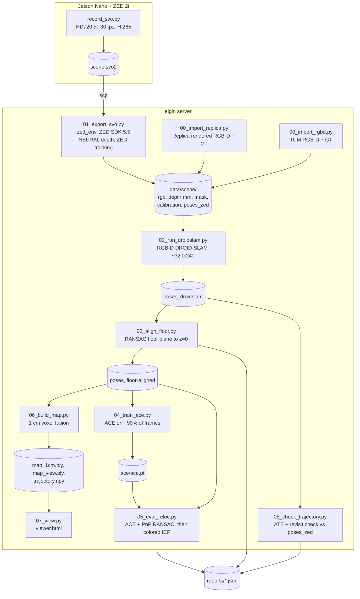

# ZED Mapping Check: Pipeline, Results and Dataset Comparison

Date: 2026-10-08
Location: `elgin:~/Rivindu/zed_mapping_check`
Scenes covered: `room0` (Replica), `wall` (Stereolabs demo SVO), `myroom` (own ZED 2i recording, first take, deleted), `myroom2` (own ZED 2i recording, second take)

---

## 1. Purpose

This project checks whether the DovSG mapping and relocalization approach works on data from our own ZED 2i camera. It runs the stages that DovSG uses to build a map and relocalize in it, outside the DovSG code base:

1. Camera poses from DROID-SLAM (RGB-D mode).
2. Floor alignment of the map.
3. A fused 1 cm voxel map.
4. An ACE scene-coordinate regression model trained on the scan.
5. Relocalization of unseen frames with ACE, refined with multi-scale colored ICP.

The project is deliberately separate from DovSG. It reads only the DROID-SLAM package and weights, and DovSG's vendored `ace/` package. No DovSG file is modified.

---

## 2. Hardware and software

| Item | Value |
|---|---|
| Camera | ZED 2i, S/N 29040615, firmware 1523 |
| Recording computer | NVIDIA Jetson Nano Developer Kit, 4 GB, ZED SDK 4.2.5, pyzed 4.2.5 |
| Recording mode | HD720 at 30 fps, `DEPTH_MODE.NONE`, H.265 SVO2 (SVO version 2) |
| Processing server | elgin, 3x Quadro RTX 5000 (16 GB). All runs used GPU 1 (`CUDA_VISIBLE_DEVICES=1`) because GPU 0 is shared |
| Server ZED SDK | 5.5.0 (conda env `zed_env`) |
| DROID-SLAM + Open3D env | conda env `scene_graph` (Python 3.10) |
| ACE env | DovSG virtualenv `external/DovSG/.venv` (Python 3.10) with `PYTHONPATH=external/DovSG/third_party/dsacstar_ext` |
| DROID-SLAM code | `external/Scene-Graph-Generation/DROID-SLAM/droid_slam` (matches the compiled `droid_backends` in `scene_graph`) |
| DROID-SLAM weights | `external/Scene-Graph-Generation/DROID-SLAM/droid.pth` |
| ACE code and encoder | `external/DovSG/ace/`, `ace_encoder_pretrained.pt` |

`external/` here means `~/Malshan/Scene-Graph-Navigation-with-Dynamic-Sensing/external/`.

---

## 3. Architecture



### 3.1 Data layout

Each scene lives in `data/<scene>/`:

| Folder or file | Content |
|---|---|
| `rgb/NNNNNN.jpg` | Left colour image, JPEG quality 95 |
| `depth/NNNNNN.npy` | Depth in millimetres, float32 |
| `mask/NNNNNN.npy` | Valid depth: finite and between `DEPTH_MIN` 0.3 m and `DEPTH_MAX` 5.0 m |
| `point/NNNNNN.npy` | Back-projected camera-frame points. Written by the exporters, but no later stage reads it |
| `calibration/NNNNNN.txt` | 3x3 intrinsics K for that frame |
| `poses_zed/` | Reference trajectory: ZED positional tracking for SVO input, exact ground truth for Replica and TUM |
| `poses_droidslam/` | DROID-SLAM camera-to-world poses |
| `poses/` | Floor-aligned DROID-SLAM poses. These are used by the map, ACE and the relocalization evaluation |
| `map_1cm.ply`, `map_view.ply` | Fused map at 1 cm, and a 5 cm copy for viewing |
| `viewer.html` | Self-contained viewer showing the map and the camera path |
| `ace*/ace.pt`, `heldout*.txt` | ACE head weights and the held-out frame list for each run |

### 3.2 Stage details

**Recording (`/mnt/storage/FYP/record_svo.py` on the Jetson).**
This is a small script written for this check. The ZED sample in `FYP/zed-sdk` calls `Camera.read()`, which pyzed 4.2.5 does not have. Depth is not computed on the Jetson. The SVO stores the raw stereo pair, and depth is computed on the server.

**`01_export_svo.py` (env `zed_env`).**
Opens the SVO with ZED SDK 5.5. It computes `NEURAL` depth with `COORDINATE_SYSTEM.IMAGE` (OpenCV axes) and runs ZED positional tracking as an independent reference trajectory. It keeps every `STRIDE`-th frame (default 5) and downscales the frames to at most `MAX_WIDTH` (default 1280).

**`02_run_droidslam.py` (env `scene_graph`).**
DROID-SLAM in RGB-D mode on the left image. Frames are resized to about 320x240 and cropped to multiples of 8, following DovSG's `pose_estimation.py`. Parameters:
- `buffer 2048`, `filter_thresh 2.4`, `warmup 8`, `keyframe_thresh 4.0`
- `frontend_thresh 16`, `frontend_window 25`, `backend_thresh 22`
- `upsample=True`

At the end, a global bundle adjustment runs and the trajectory filler adds the non-keyframes. The stage checks that the depth is in millimetres before it starts.

**`03_align_floor.py`.**
Estimates "down" as the mean camera y-axis. It takes the lowest 20% of the world points and fits a plane with RANSAC (3 cm threshold, 2000 iterations). It then rotates the plane normal to +z and moves the floor to z = 0. The stage passes if the floor z std is under 2 cm and the tilt is under 25 degrees.

**`06_build_map.py`.**
Fuses every 3rd frame (`MAP_FRAME_INTERVAL`, same as DovSG `demo.py`). Each frame is downsampled to 1 cm voxels, then the whole map is downsampled to 1 cm again. Statistical outlier removal uses `nb_neighbors=35` and `std_ratio=1.5` (DovSG defaults).

**`08_check_trajectory.py`.**
Rigid alignment (no scale) of the reference trajectory to DROID-SLAM, then:
- **ATE RMSE and max.**
- **Path length and end-to-start gap.**
- **Revisit check, a form of loop closure.** It finds frame pairs closer than 0.5 m with viewing directions within 40 degrees, at least `max(10, N/5)` frames apart. It then compares the relative pose of each pair in DROID-SLAM against the reference.

The pass marks are ATE RMSE under 5 cm and a median revisit error under 5 cm.

**`04_train_ace.py` (DovSG `.venv`).**
Trains DovSG's vendored ACE on the floor-aligned poses. There are two hold-out modes:
- `interleave`: every 10th frame is held out. This is easy, because the neighbours of each held-out frame are in training.
- `block`: one contiguous segment of about 10%, starting at 45% of the sequence, is held out. This is harder, because only revisits of that area help.

ACE config (`ace/configs/train.yml`):
- `num_head_blocks 1`, `training_buffer_size 8,000,000`, `samples_per_image 1024`
- `batch_size 5120`, `epochs 16`, learning rate 0.0005 to 0.005
- `image_resolution 384`, `use_half`, augmentation with 15 degrees rotation and 1.5 scale

Two shims avoid editing DovSG:
- A counting `AdamW`, because newer PyTorch no longer sets `optimizer._step_count`.
- An optional `--buffer` override for shared GPUs.

**`05_eval_reloc.py` (DovSG `.venv`).**
1. ACE predicts scene coordinates, and PnP RANSAC (`dsacstar`, 64 hypotheses, 10 px threshold) gives a pose for each held-out frame.
2. The pose is refined with multi-scale colored ICP at 4, 2 and 1 cm (50, 30 and 14 iterations, `lambda_geometric 0.9999`). The ICP target is a map fused from the training frames only, cropped to plus or minus 3 m around the ACE estimate. ICP counts as successful only when the finest level is accepted, with at least 20% correspondences.
3. A frame passes when it is within 5 cm and 5 degrees.

The "ground truth" in this stage is the floor-aligned DROID-SLAM pose, for every dataset, including Replica.

**`07_view.py`.**
Builds `viewer.html` from `map_view.ply` and `poses/`. The ACE stages do not change the viewer or the map.

---

## 4. Datasets

| | Replica `room0` | Stereolabs `wall` | Own `myroom` (take 1) | Own `myroom2` (take 2) |
|---|---|---|---|---|
| Source | Rendered (NICE-SLAM copy) | Stereolabs demo SVO `wall.svo` | ZED 2i on Jetson | ZED 2i on Jetson |
| Sensor noise | None | Real ZED | Real ZED | Real ZED |
| Reference poses (`poses_zed`) | Exact ground truth | ZED tracking | ZED tracking | ZED tracking |
| Raw length | – | 54 MB SVO | 2089 frames, 70 s, 96 MB | 1132 frames, about 38 s, 50 MB |
| Import stride | 12 | – | 5 | 5 |
| Frames used | 167 | 80 | 418 | 227 |
| Saved resolution | 640x363 | 640x360 | 1280x720 (export default) | 1280x720 |
| fx | 320.0 | 346.9 | 524.6 | 524.6 |
| Path length | 24.3 m | 2.8 m | 13.8 m | 3.9 m |
| Map voxels at 1 cm | 2,210,807 | 998,116 | 6,842,099 | 2,861,012 |
| Disk use | 717 MB | 344 MB | 6.4 GB (deleted) | 3.5 GB |

The `myroom` take covered a long path through the room. It was replaced by `myroom2`: one slow, short loop of about 4 m, with the floor in view, ending at the start.

---

## 5. Results

### 5.1 Trajectory and floor

| Metric | Replica `room0` | `wall` | `myroom` (take 1) | `myroom2` | Pass mark |
|---|---|---|---|---|---|
| DROID-SLAM poses / frames | 167 / 167 | 80 / 80 | 418 / 418 | 227 / 227 | equal |
| ATE RMSE | **1.0 cm** | 0.9 cm | 17.0 cm | **2.6 cm** | < 5 cm |
| ATE max | 2.4 cm | 3.1 cm | 82.7 cm | 5.2 cm | – |
| End-to-start gap | 86.7 cm | 254.5 cm | 40.7 cm | 22.1 cm | info only |
| Revisit pairs | 19 | 0 | 6647 | 1953 | – |
| Revisit error, median | 0.7 cm, 0.09° | – | 26.1 cm, 4.05° | 4.9 cm, 2.37° | < 5 cm |
| Revisit error, max | 1.9 cm | – | 98.9 cm | 8.9 cm | – |
| Floor z std | 0.8 cm | 1.7 cm | 1.5 cm | 1.1 cm | < 2 cm |
| Floor tilt vs camera up | 5.5° | 18.5° | 1.1° | 4.2° | < 25° |
| Trajectory check | pass | pass (no loop) | **fail** | **pass** | |
| Floor check | pass | pass | pass | pass | |

### 5.2 ACE relocalization and colored ICP

| Run | Held out | ACE within 5 cm / 5° | ACE median | ACE+ICP within 5 cm / 5° | ACE+ICP median | ICP success |
|---|---|---|---|---|---|---|
| `room0` interleave (`_i`) | 17 | 100% | 4.3 mm | 100% | 6.4 mm | 94.1% |
| `room0` block (`_b`) | 16 | 100% | 9.4 mm | 93.8% | 7.4 mm | 100% |
| `wall` interleave | 8 | 100% | 4.3 mm | 100% | 3.0 mm | 100% |
| `myroom2` interleave | 23 | **100%** | **3.5 mm** | 100% | 7.5 mm | 100% |
| `myroom2` block (`_b`, frames 102 to 123) | 22 | **100%** | **7.6 mm** | **63.6%** | 12.7 mm | 100% |

The worst ACE error in the `myroom2` block run was 1.9 cm and 1.88°.

ACE training on `myroom2` (interleave) took 526 s on GPU 1: 68 s to fill the buffer and 459 s to train. The final loss was about 2.7, with 99.5% valid samples. DROID-SLAM on `myroom2` took 19 s (11.9 frames/s).

### 5.3 Frames where ICP made `myroom2` block worse

| Frame | ACE trans | ACE rot | ICP trans | ICP rot |
|---|---|---|---|---|
| 000103 | 0.6 cm | 0.50° | 0.8 cm | 5.23° |
| 000104 | 1.0 cm | 0.82° | 5.3 cm | 0.62° |
| 000105 | 0.5 cm | 0.41° | 7.1 cm | 4.19° |
| 000107 | 0.8 cm | 0.62° | 13.6 cm | 10.78° |
| 000108 | 0.6 cm | 0.53° | 8.9 cm | 3.10° |
| 000110 | 1.3 cm | 1.37° | 5.6 cm | 4.36° |
| 000111 | 1.3 cm | 1.35° | 24.3 cm | 17.83° |
| 000112 | 1.2 cm | 1.22° | 13.4 cm | 9.81° |

In every case ACE alone was within 1.3 cm and 1.4 degrees. ICP converged, and so reported success, but moved the pose away from the correct one.

---

## 6. Comparison and discussion

### 6.1 DROID-SLAM on real ZED data compared with Replica

- **Replica: 1.0 cm ATE against exact ground truth.** This is the real DROID-SLAM error on clean, rendered data.
- **`myroom2`: 2.6 cm ATE against ZED tracking.**
  - ZED tracking has its own error, so this number combines the errors of two trackers. DROID-SLAM's own error is probably lower.
  - The two numbers are therefore not strictly comparable, but both are well under the 5 cm pass mark.
- **The revisit error is higher on `myroom2`** (4.9 cm and 2.4 degrees, against 0.7 cm and 0.09 degrees on Replica). Part of this is again the noisier reference.
- **The 22 cm end-to-start gap is not a loop-closure failure.** It shows only where the recording stopped compared with where it started. The revisit check is the loop-closure test, and it passes.

### 6.2 Why the first take failed

- **Longer and faster path.** `myroom` covered 13.8 m in 70 s, against 3.9 m in about 38 s for `myroom2`.
- **Drift accumulated over the long path** and was not fully corrected. The errors show it: 17 cm ATE, up to 83 cm, and 26 cm median revisit error.
- **The fix was capture technique, not parameter tuning,** as the project README recommends: one slow, short loop with the floor and textured surfaces in view, ending at the start.

### 6.3 ACE

- **ACE is the strongest result.** It localizes every held-out frame in every run, including the harder block hold-out.
- **On `myroom2` its median error is equal to or lower than on Replica:** 3.5 mm against 4.3 mm for interleave, and 7.6 mm against 9.4 mm for block.
- **So ZED stereo depth plus DROID-SLAM poses are good enough to train a reliable ACE model** for this room.

### 6.4 Colored ICP

- **ICP never clearly improves on ACE here.** In the interleaved runs, ACE+ICP is worse than ACE alone on both Replica (6.4 against 4.3 mm) and `myroom2` (7.5 against 3.5 mm). This follows from the method:
  - The map resolution is 1 cm and the ICP finest level is 1 cm.
  - So ICP cannot refine a pose that is already accurate to a few millimetres.
- **On `myroom2` with block hold-out, ICP fails badly on 8 of 22 frames** and drops the pass rate from 100% to 63.6%. On Replica the same test keeps 93.8%. Likely reasons:
  - ZED depth is noisier than rendered depth, especially at edges.
  - With a whole segment held out, the target map near those frames is thinner, so ICP can lock onto the wrong surface.
- **ICP's "success" flag does not detect these failures.** The flag only checks that the finest level converged with enough correspondences, and it was 100% even when the pose got worse.

### 6.5 Limits of the evaluation

- **The relocalization "ground truth" is the floor-aligned DROID-SLAM pose** for every dataset, including Replica. So the ACE and ICP numbers measure consistency with the SLAM map, not absolute accuracy.
- **Held-out frames come from the same recording as the training frames.** The scores measure localization inside a scanned area. They do not measure relocalization after the scene changes (moved objects, different light, another day).
- **Small test sets.** Each hold-out set has only 8 to 23 frames.
- **DROID-SLAM uses only the left image and depth.** The right image and the ZED IMU are unused.
- **`wall` has no loop** (end-to-start gap 2.5 m, no revisit pairs), so it only tests the exporter and the basic pipeline.

---

## 7. Status against the README stopping criteria (`myroom2`)

| Check | Result | Status |
|---|---|---|
| DROID-SLAM completes | 227 poses for 227 frames, no NaN | pass |
| Trajectory vs reference | ATE RMSE 2.6 cm | pass |
| Floor alignment | z std 1.1 cm, tilt 4.2° | pass |
| Fused map: single-layer walls, loop closes | Revisit check passes. Visual check in `viewer.html` still to be confirmed | pending visual check |
| ACE training | finished, `ace.pt` written | pass |
| ACE held-out at least 80 to 90% within 5 cm and 5° | 100% (interleave), 100% (block) | pass |
| Colored ICP not worse than ACE alone | worse by 4 mm (interleave), worse by 5 mm and 36 points of pass rate (block) | fail |

---

## 8. Recommendations

1. **Use ACE as the main relocalization result** on ZED data. It is accurate to a few millimetres in this room.
2. **Gate ICP before trusting it.** Accept the ICP pose only when it stays close to the ACE pose, for example within 3 cm and 3 degrees, or when the ICP fitness clearly improves. Otherwise keep the ACE pose. This check is not implemented yet. Adding it to `05_eval_reloc.py` would let us measure its effect on the block run.
3. **Recording technique:**
   - One slow loop of 4 to 6 m, 30 to 60 s.
   - Floor in view, camera 1 to 3 m from surfaces, textured objects in view.
   - End where you started and hold still for a few seconds.
4. **Next tests for a realistic relocalization check:**
   - Record a second session of the same room on another day, or after moving some objects.
   - Localize that session against the `myroom2` ACE model.
   - This is the case DovSG actually needs, and the current hold-out tests do not cover it.
5. **Optional improvements:**
   - Try `ULTRA` or `QUALITY` depth against `NEURAL`.
   - Try a tighter `DEPTH_MAX`.
   - Use the ZED IMU or stereo pair if drift returns on larger rooms.

---

## 9. How to reproduce

### 9.1 Record on the Jetson

```bash
ssh jetson
sudo nvpmodel -m 0 && sudo jetson_clocks          # optional, avoids dropped frames in 5 W mode
python3 /mnt/storage/FYP/record_svo.py /mnt/storage/FYP/<scene>.svo2   # Ctrl-C to stop, wait for "saved"
```

### 9.2 Copy to the server

```bash
scp -3 jetson:/mnt/storage/FYP/<scene>.svo2 entc:Rivindu/zed_mapping_check/data/
```

### 9.3 Map and trajectory check (server)

```bash
cd ~/Rivindu/zed_mapping_check
S=~/Malshan/Scene-Graph-Navigation-with-Dynamic-Sensing/external/Scene-Graph-Generation/DROID-SLAM
export DOVSG_ROOT=~/Malshan/Scene-Graph-Navigation-with-Dynamic-Sensing/external/DovSG \
       DROID_PKG=$S/droid_slam DROID_WEIGHTS=$S/droid.pth CUDA_VISIBLE_DEVICES=1
ENV_ZED=zed_env ENV_DROID=scene_graph ENV_DOVSG=scene_graph ./run_all.sh <scene> data/<scene>.svo2
```

### 9.4 ACE training and relocalization (server)

```bash
D=~/Malshan/Scene-Graph-Navigation-with-Dynamic-Sensing/external/DovSG
export DOVSG_ROOT=$D CUDA_VISIBLE_DEVICES=1 PYTHONPATH=$D/third_party/dsacstar_ext
$D/.venv/bin/python 04_train_ace.py --scene <scene>                                   # interleave
$D/.venv/bin/python 05_eval_reloc.py --scene <scene>
$D/.venv/bin/python 04_train_ace.py --scene <scene> --holdout_mode block --run _b     # block
$D/.venv/bin/python 05_eval_reloc.py --scene <scene> --run _b
```

---

## 10. Environment problems found and fixes

| Problem | Cause | Fix |
|---|---|---|
| `FileNotFoundError: .../DovSG/checkpoints/droid-slam/droid.pth` | That file is a symlink to `~/Malshan/Scene-Graph-Generation/...`, a folder that has since moved | Set `DROID_WEIGHTS` to `external/Scene-Graph-Generation/DROID-SLAM/droid.pth` |
| `altcorr_forward(): incompatible function arguments` during global BA | The `droid_backends` compiled in `scene_graph` is the newer 6-argument version. DovSG's `droid_slam` Python code is older and passes 4 arguments | Set `DROID_PKG` to `external/Scene-Graph-Generation/DROID-SLAM/droid_slam`, the source that the backend was built from |
| `ModuleNotFoundError: No module named 'pyrender'` in `04_train_ace.py` | `scene_graph` has no `pyrender` or `dsacstar` | Use DovSG's `.venv`, which has `pyrender`, and add `third_party/dsacstar_ext` to `PYTHONPATH` |
| `ImportError: libc10.so` when importing `dsacstar` | The extension needs PyTorch's libraries loaded first | Import `torch` before `dsacstar` (ACE already does this) |
| Default `DOVSG_ROOT` does not exist on the server | `config.py` defaults to the laptop path `/home/rivindu02/Documents/FYP/DovSG` | Export `DOVSG_ROOT` as above |
| `run_all.sh` env names `droidenv` and `dovsg` do not exist | Example names in the script | Set `ENV_ZED`, `ENV_DROID` and `ENV_DOVSG` |
| ZED sample `svo_recording.py` fails on the Jetson | It calls `Camera.read()`, which pyzed 4.2.5 lacks | Use `record_svo.py`, which uses `grab()` |
| Server disk at 99% | Shared server | `point/` folders are not read after export and can be deleted. `myroom` was deleted |

---

## 11. Output files

| File | Content |
|---|---|
| `data/myroom2/viewer.html` | Map and trajectory viewer (copy on laptop: `~/Downloads/myroom2_viewer.html`) |
| `data/myroom2/map_1cm.ply` | 1 cm fused map, 2.86 M points |
| `data/myroom2/ace/ace.pt`, `ace_b/ace.pt` | ACE heads for the interleave and block runs |
| `reports/myroom2_floor.json`, `myroom2_trajectory.json` | Floor and trajectory metrics |
| `reports/myroom2_reloc.json`, `myroom2_b_reloc.json` | Relocalization summary and per-frame errors |
| `reports/room0_*.json`, `wall_*.json` | Replica and demo-SVO results used for comparison |
| `/mnt/storage/FYP/myroom2.svo2` (Jetson) | Raw recording |
